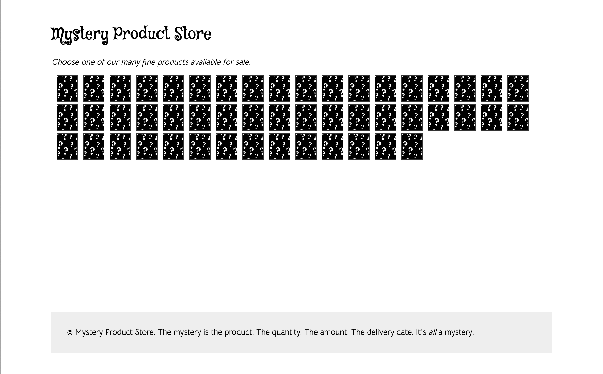
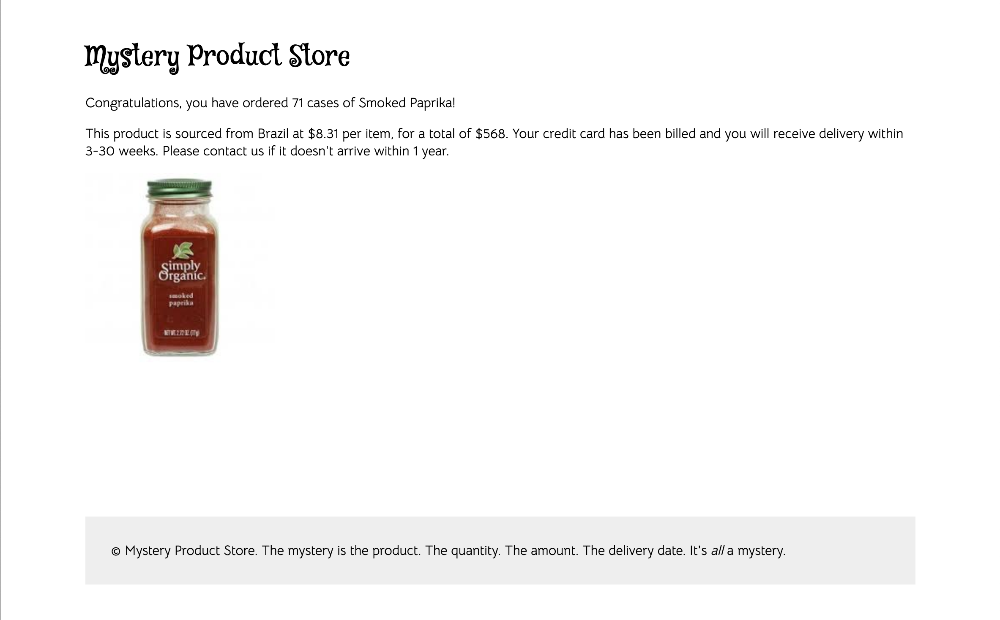

# Learning Vue Router

This is a short tutorial on beginning concepts of Vue Router. This
library is used to help you divide your web application into multiple pages. Vue Router maps each URL to a component that is used to display the page
of content for that URL.

We'll use the Vue CLI to build a small store application to show you several
concepts. You should recognize this as a rebuilt version of the grocery store from [Grocery Store](https://github.com/BYU-CS-260/grocery-store) lab.

## Running this code

Assuming you have Node.js and the Vue CLI installed you can run this code
with:

```
npm install
npm run serve
```

You should see this home page:



And when you click on a product page will get something like this:



Let's dive in and see how the Vue Router works

## Router Setup

The setup for the Vue Router is in `src/main.js`:

```javascript
import Vue from 'vue'
import App from './App.vue'
import router from './router'

Vue.config.productionTip = false

import mock from './mock-data.js'

let data = {
  products: mock,
}

new Vue({
  router,
  data,
  render: h => h(App)
}).$mount('#app')
```

The `import` statement for the vue Router imports the configuration in `router/index.js`.

At the bottom of the file, the `router` variable from this import is passed to the Vue instance when it is created.

## Router Configuration

The file `router/index.js` has the router configuration. At the top
is some import statements:

```javascript
import Vue from 'vue'
import VueRouter from 'vue-router'
import Home from '../views/Home.vue'
import Product from '../views/Product.vue'

Vue.use(VueRouter)
```

The first two imports succeed because we have installed Vue and Vue
Router using `npm install`. This is done for us by the `vue create`
command.

The next two import components from the `views` folder. Views are components that are used as pages for the Vue Router. They are otherwise identical to all other Vue components.

The last line tells Vue that we will be using the Vue Router.

```javascript
const routes = [{
    path: '/',
    name: 'home',
    component: Home
  },
  {
    path: '/product/:id',
    name: 'product',
    component: Product
  }
]
```

These lines setup the routes for the Vue Router. Each one can have a `path`, a `name`, and a `component`. The `path` shows the URL for the site. The `name` is a shortcut that you can use to refer to the route instead of using the `path`. The `component` provides the view that will be used for that route.

Notice that the second path use a variable `id`. This will match any path that starts with `product`, such as `product/10` or `product/14`. In our case the `:id` will be an integer, but it can also match strings.

```javascript
const router = new VueRouter({
  mode: 'history',
  base: process.env.BASE_URL,
  routes
})

export default router
```

This creates an instance of a Vue Rotuer, passing it a configuration object, including the routes defined above.

The last statement exports the router from this script, which is imported from `src/main.js`.

## Using Vue Router

The `src/App.vue` file is the first place we use Vue Router. This file is the top-level component for your entire Vue CLI application. Think of all other components in your app as branches from this root:

* App.vue
  - Vue Router
     - Home.vue
     - Product.vue

In `App.vue` we have the following:

```html
<div class="header">
  <h1>Mystery Product Store</h1>
</div>
<div class="content">
  <router-view />
</div>
<div class="footer">
  &copy; Mystery Product Store. The mystery is the product. The quantity. The amount.
  The delivery date. It's <i>all</i> a mystery.
</div>
```

The header and footer will appear on all pages. The `router-view` element will be replaced by the Vue Router with the view for the current page. For the `/` URL, the router configuration puts the `Home.vue` component here. For the `/product/:id` URL, the router configuration puts the `Product.vue`
component here.

## Home Page

The home page uses the following template:

```html
<template>
<div>
  <p class="intro">Choose one of our many fine products available for sale.</p>
  <p class="products">
    <router-link v-for="product in products" :key="product.id" :to="'/product/' + product.id">
      
    </router-link>
  </p>
</div>
</template>
```

This shows you how to link from one page in your application to another. In previous tutorials we have done this with a menu in the header. But you can also do it within a component.

Any time you create a link, use `router-link`. The `to` attribute indicates the path to use. In this case, we use data binding with `:to` because we want to use a JavaScript variable for this attribute.

You can also create a link using a name for it. So we could have done this above:

```javascript
<router-link v-for="product in products" :key="product.id" :to="{ name: 'product', params: { id: product.id }}">
```

Note, in both cases getting the syntax for data binding is tricky. If you want to combine a string with JavaScript, enclose the whole thing in double quotes and then the string portions in single quotes.

Another interesting part of this page is that we are using a `v-for` directive on the `router-link` element. This means we will generate one link for each product.

Here is the `script` portion of the home page:

```javascript
<script>
import underscore from 'underscore';
export default {
  name: 'Home',
  computed: {
    products() {
      return underscore.shuffle(this.$root.$data.products);
    }
  }
}
</script>
```

We are using the [Underscore.js](https://underscorejs.org/) library, which has some handy functions. Note the import statement in the script. This goes outside the export statement.

We use `underscore` in the computed `products()` property, which gives us a random shuffle of products. This adds more to the *mystery* aspect of our
mystery store.

## Product Page

Now we'll show you the product page. This is the template:

```html
<template>
<div>
  <div class="info">
    <p>Congratulations, you have ordered {{random}} cases of {{product.name}}!</p>

    <p>This product is sourced from {{product.country}} at {{product.price}} per item,
      for a total of ${{amount}}. Your credit card has been billed and you will receive
      delivery within 3-30 weeks. Please contact us if it doesn't arrive within 1 year.</p>
  </div>
  <div class="image">
    
  </div>
</div>
</template>
```

This assumes there is a `product` property, along with properties called
`random` (the amount of cases the person ordered) and `amount` (the total amount the person is charged).

Here is the `script`:

```javascript
<script>
export default {
  name: 'Home',
  data() {
    return {
      random: 0,
      amount: 0,
      product: {},
    }
  },
  created() {
    this.product = this.$root.$data.products.find(product => product.id === parseInt(this.$route.params.id));
    this.random =
      Math.floor(Math.random() * 90) + 10;
    this.amount = this.random * parseFloat(this.product.price.replace(/\$|,/g, ''));
    this.amount = this.amount.toFixed(2);
  },
}
</script>
```

This initializes the three properties to default values and then uses
the `created()` hook to get the needed data for this product. Generally, you will need to use `created()` whenever a view relies on a variable from the route, like the `:id`.

There are 50 products in the store, and this page will show one
of the products based on the `:id` in the URL. For example, `/product/10` will show product number 10.

To access the `:id` within the component, we use `this.$route.params.id`.
For the `product` property we use the `find` function to find the
product in the global products array. One trick is that the product IDs
are integers but the ID in `this.$route.params.id` is a string. We have to use `parseInt()` to convert it to an integer.

For the `random` property we use the Math library to generate a random number between 0 and 90 and then add this to 10, so the customer orders between 10 and 100 cases.

For the `amount` we again need to use `parseFloat()` to convert the string price into a floating point number, but we first have to strip out the leading dollar sign. We also use `toFixed()` to round two decimal places.

## More with Routing

You can do a lot with just these basic features of Vue Router. However, there are additional features of the Vue Router that you might find useful in more advanced situations.
These include [Dynamic Route Matching](https://router.vuejs.org/guide/essentials/dynamic-matching.html), [Nested Routes](https://router.vuejs.org/guide/essentials/nested-routes.html), and [Programmatic Navigation](https://router.vuejs.org/guide/essentials/navigation.html).
